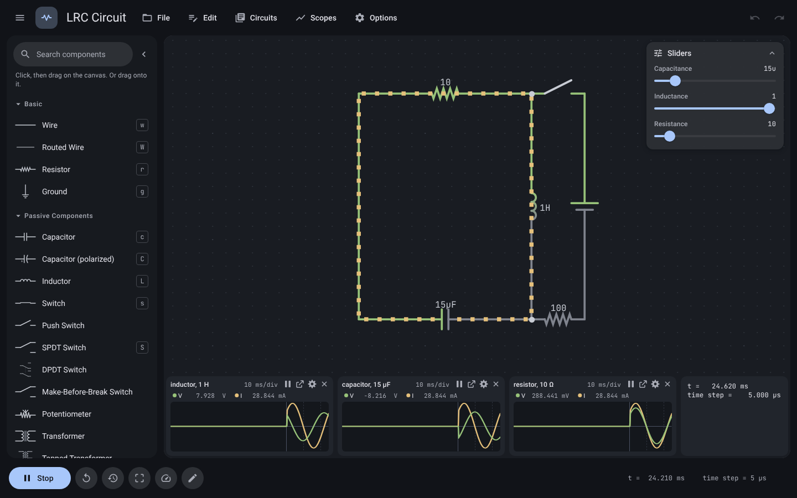
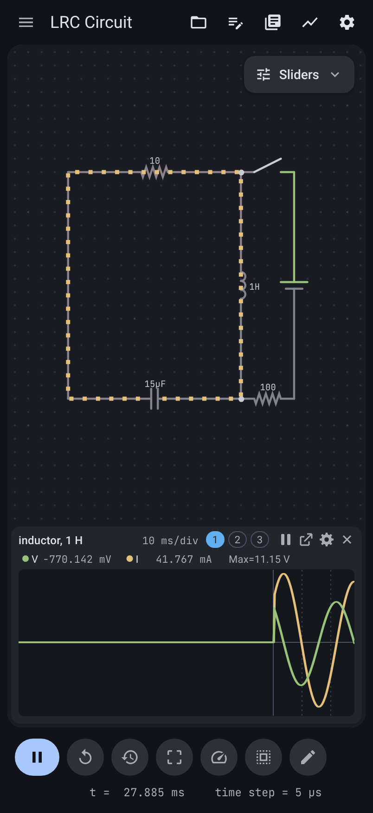

# Perun

An electronic circuit simulator that runs in the browser: a TypeScript rebuild of
[CircuitJS1](https://github.com/pfalstad/circuitjs1), Paul Falstad's simulator, with a new interface
and a JSON theme system. Simulation results and circuit files stay compatible with CircuitJS1: it
opens upstream's links and files, and what it saves opens in upstream.

**Open it: [noiseweaver.github.io/perun](https://noiseweaver.github.io/perun/)**.
Nothing to install, and it works offline once loaded.

<p>
  
  
</p>

## Install it as an app

- **iPhone and iPad:** open the link in Safari, tap Share, then Add to Home Screen. Open it once
  while online; after that it works offline.
- **Android, Chrome and Edge:** File > Install app, or the install button in the address bar.

Your circuit is kept between visits. File > Save writes it to a file, and File > Send a suggestion
reaches the maintainer.

## In Obsidian

The Perun plugin for [Obsidian](https://obsidian.md) runs ` ```circuit ` code blocks live in
notes and opens `.circuit` files in the full editor, on desktop and mobile. See
[packages/obsidian](packages/obsidian/README.md) for how to install it.

## What it does

- Every element in upstream master (154 classes), including subcircuits, custom logic, routed wires
  and the model editors for diodes, transistors, MOSFETs, relays and subcircuit pin layouts.
- All 373 bundled upstream example circuits run and match upstream's results (`pnpm
golden:examples`, report in [docs/EXAMPLES.md](docs/EXAMPLES.md)).
- Scopes (docked, undocked, X-Y, FFT, triggers), live sliders, hover info with fixed-width values.
- Analysis: AC analysis with Bode plots, parameter sweeps, Monte Carlo, a DC operating point
  table, temperature and subcircuit parameters.
- Seeing how it works: formula cards with live values, field views for coils and capacitors, a heat
  view, and rewind to scrub through the last 10 seconds.
- Editing extras: wires follow a dragged part (Options > Wires follow dragged parts, Alt to
  detach), schematic export as SVG or PNG, a parts list as CSV, and full-resolution scope CSV.
- Teaching tools: draw on the circuit with a pencil, point with a fading laser, erase; drawings are
  an overlay and never saved in the circuit file.
- Themes: Dark (default), Light, Classic, Classic Dots, High Contrast, Colorblind Safe and community
  themes, a live theme editor, and themes shared by link or file ([docs/THEMES.md](docs/THEMES.md)).
- Installable and offline (a PWA, including on iPad and iPhone), keyboard accessible, and translated
  with upstream's string catalogs (Options > Language).

## Using it

Open the built app in a browser. File > Open file reads CircuitJS1 text and XML circuits; Open link
reads `circuitjs.html?ctz=…` and `?cct=…` links. File > Export link writes one back, with an option
to include your theme. The palette on the left places components (click, then drag on the canvas);
selecting one shows its properties on the right.

## Development

Requires Node 22.13 or later and pnpm 10. Docker is needed only for the upstream reference build.

```sh
git clone --recurse-submodules https://github.com/noiseweaver/perun
cd perun
pnpm install
pnpm --filter @perun/app dev     # http://localhost:5173
pnpm --filter @perun/app build   # static site in packages/app/dist
pnpm check                                # typecheck, lint, format check, unit tests
pnpm test:e2e                             # Playwright browser tests
```

The built site is static: serve `packages/app/dist` from any web server. The example circuits and
translations are copied in from the `reference/circuitjs1` submodule at build time.

### Layout

```
packages/engine    MNA engine (no DOM)
packages/elements  element simulation, property schemas and views
packages/format    circuit text/XML and link parsing and saving
packages/theme     theme schema, validation and built-ins
packages/render    Canvas 2D drawing, scene and hit testing
packages/app       the interface (React, Radix, Zustand)
packages/obsidian  the Obsidian plugin: circuit blocks, and the app in a tab for .circuit files
tools/             reference build, golden harness, benchmarks, theme docs, i18n coverage
fixtures/          recorded reference traces
```

### Compatibility testing

Upstream is pinned as a read-only submodule ([docs/UPSTREAM.md](docs/UPSTREAM.md)). `pnpm
reference:build` builds it in Docker, `pnpm golden:record` records reference traces from it, and
`pnpm golden:compare --engine next` checks this engine against them. Any intended difference from
upstream is listed in [docs/DEVIATIONS.md](docs/DEVIATIONS.md).

### Docs

[PLAN](docs/PLAN.md), [PROGRESS](docs/PROGRESS.md), [DEVIATIONS](docs/DEVIATIONS.md),
[ELEMENTS](docs/ELEMENTS.md), [ENGINE-NOTES](docs/ENGINE-NOTES.md), [THEMES](docs/THEMES.md),
[EXAMPLES](docs/EXAMPLES.md), [UPSTREAM](docs/UPSTREAM.md).

## License and credits

GPL-2.0-or-later, see [LICENSE](LICENSE). This program is free software: you can redistribute it
and/or modify it under the terms of the GNU General Public License as published by the Free
Software Foundation, either version 2 of the License, or (at your option) any later version. It is
distributed in the hope that it will be useful, but without any warranty.

Perun is made and maintained by Gadiel Zintu ([github.com/noiseweaver](https://github.com/noiseweaver)).

CircuitJS1 is Copyright (C) Paul Falstad and Iain Sharp ([falstad.com](https://www.falstad.com/),
[lushprojects.com](http://lushprojects.com/)), with the contributors its README and About box
list; the app's About dialog repeats them. Files ported from CircuitJS1 name their upstream source
file and commit in their header. The example circuits and translation catalogs are upstream's.
LZString is (c) 2013 pieroxy. The bundled Roboto and JetBrains Mono fonts are under the SIL Open
Font License. The built app carries its own GPL text at `LICENSE.txt` and every bundled
third-party license at `third-party-licenses.txt`, both linked from File > About.
